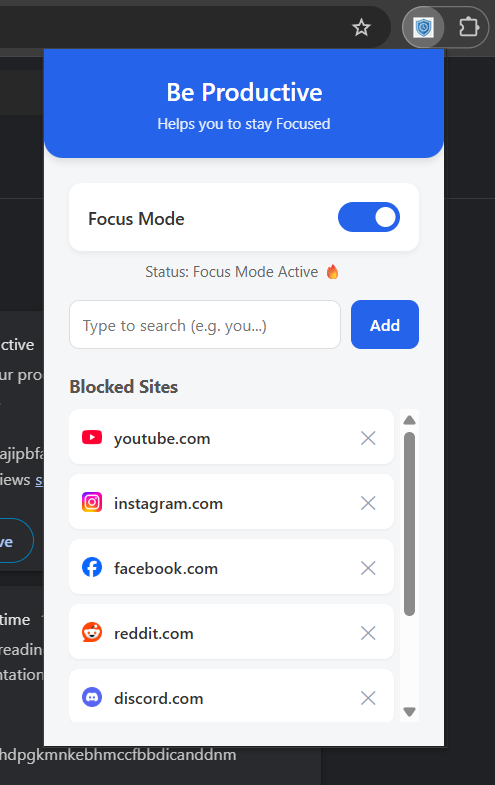
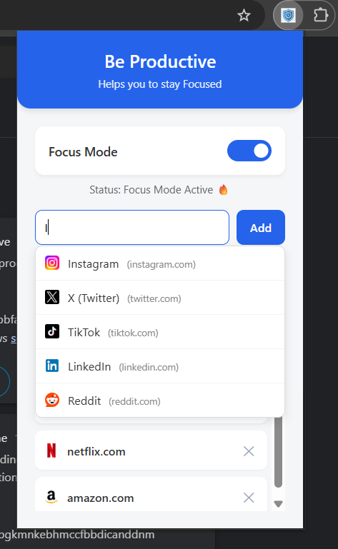
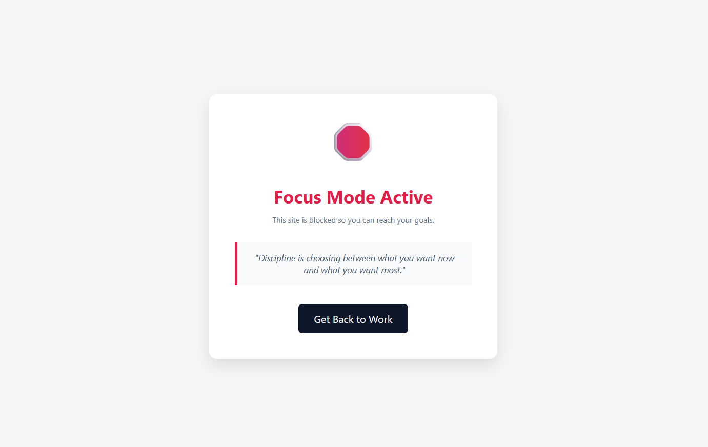

# Be Productive 🎯


**Be Productive** is a lightweight, privacy-focused Chrome Extension designed to help you regain control of your attention. It allows users to block distracting websites during study or work sessions with a simple toggle switch.

Built using **Manifest V3**, this extension leverages native Chrome APIs to ensure low memory usage and high performance.

## 📸 Screenshots

| Extension Popup | Smart Search | Blocked Screen |
|:---:|:---:|:---:|
|  |  |  |
## ✨ Features

### **New in v1.1 🚀**
* **🔍 Smart Autocomplete:** Instant search suggestions for the top 50+ most distracting websites (YouTube, Instagram, Reddit, etc.) so you don't have to type the full URL.
* **🖼️ Visual Icons:** Automatically fetches and displays high-quality favicons for every blocked site using Google's S2 service.
* **📜 Scrollable List:** A clean, scrollable view for managing long blocklists without cluttering the UI.

### **Core Features**
* **⚡ Instant Focus Mode:** Toggle blocking on/off instantly with a clean UI.
* **💪 Motivational Redirect:** Instead of a generic error, blocked pages redirect to a custom "Access Denied" page with motivational quotes to get you back on track.
* **💾 Persistent Settings:** Uses `chrome.storage.sync` to save your preferences and blocklist across browser sessions.
* **🔒 Privacy First:** No tracking. All data is stored locally on your device.

## 🛠️ Tech Stack

* **HTML5 & CSS3** (Flexbox/Grid, Custom Scrollbars, Animations)
* **JavaScript (ES6+)**
* **Chrome Extension APIs** (Manifest V3)
    * `chrome.tabs` (URL detection)
    * `chrome.storage` (Data persistence)
    * `chrome.scripting`

## 🎥 Setup Walkthrough

Watch this quick video to see how to install **Be Productive** and start blocking distractions in under 60 seconds.


## 🚀 Installation & Setup

Since this extension is in **Developer Mode**, you need to load it manually into Chrome.

1.  **Download the Code**
    * Click the green **Code** button on this page.
    * Select **Download ZIP**.
    * Unzip the file to a folder on your computer.

2.  **Open Chrome Extensions**
    * Open Google Chrome.
    * Navigate to `chrome://extensions/` in the address bar.

3.  **Enable Developer Mode**
    * Toggle the **"Developer mode"** switch in the top-right corner.

4.  **Load the Extension**
    * Click the **"Load unpacked"** button (top-left).
    * Select the root folder where you extracted the ZIP file.

5.  **Pin & Use**
    * Click the 🧩 (Puzzle) icon in your Chrome toolbar.
    * Pin **Be Productive** for easy access.

## 📂 Project Structure

```text
/be-productive
  ├──manifest.json        # Extension configuration (Manifest V3)
  ├──background.js        # Service worker for URL checking
  ├──/popup               # UI Logic
  │   ├──popup.html       # The interface
  │   ├──popup.css        # Styling (Blue theme, rounded UI)
  │   ├──popup.js         # Logic (Storage, Autocomplete, Icons)
  │   └──sites.js         # Local database for search suggestions
  ├──/block-page          # The redirect page
  │   ├──blocked.html
  │   ├──blocked.css
  │   └──blocked.js
  └──/images              # App icons & UI Preview