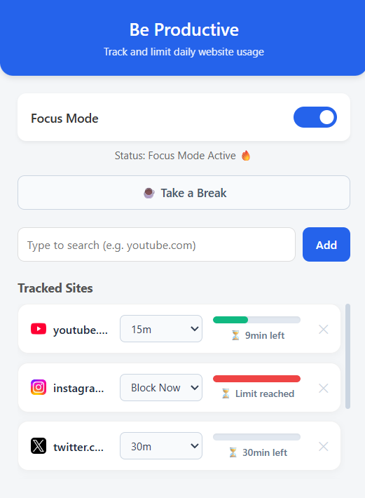
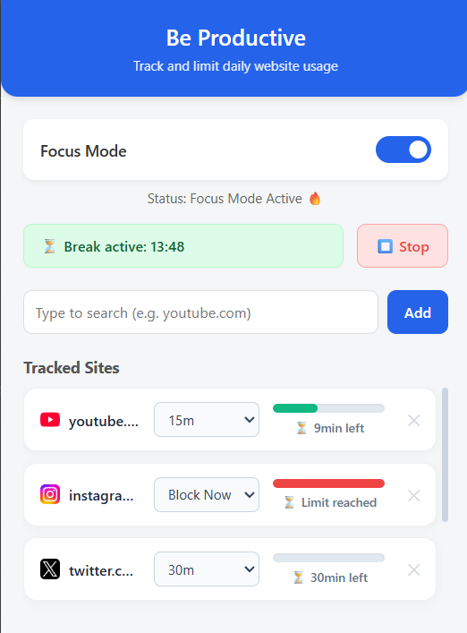
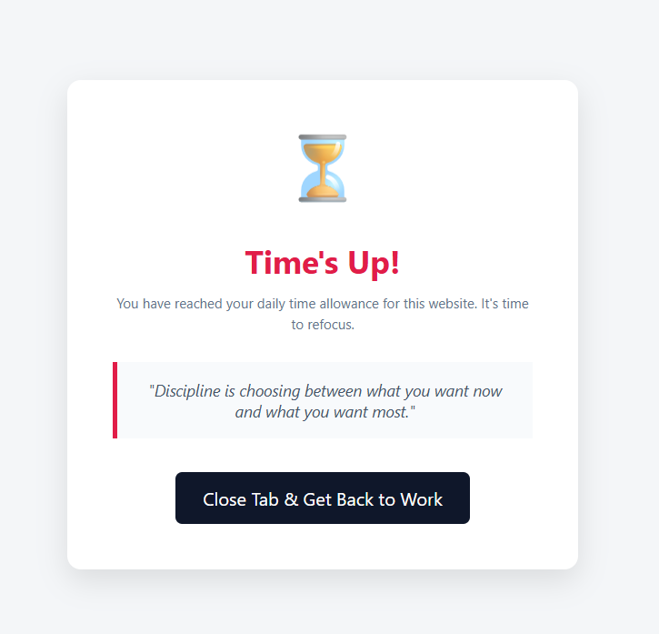

# Be Productive 🎯


**Be Productive** is a modern, privacy-focused Chrome Extension designed to help you regain control of your attention. Move beyond strict blocking with intelligent daily time limits and structured breaks to maintain long-term productivity.

Built using **Manifest V3**, this extension leverages native Chrome Service Workers and Alarms to ensure low memory usage, background battery efficiency, and high performance.

## 📸 Screenshots

| Dashboard & Allowances | Take a Break Mode | Blocked Screen |
|:---:|:---:|:---:|
|  |  |  |

## ✨ Features

### **New in v2.0 🔥**
* **⏳ Daily Time Allowances:** Instead of a strict "always blocked" approach, set specific daily time limits (e.g., 15 mins for Instagram, 1 hour for YouTube) for individual websites.
* **📊 Visual Progress Tracking:** A completely revamped UI featuring real-time progress bars for each site, showing exactly how much allowed time you have left before the block kicks in.
* **☕ "Take a Break" Mode:** Feeling fatigued? Temporarily pause Focus Mode for a set duration (5, 10, or 15 minutes). A live countdown keeps you on track, and a native Chrome notification alerts you when it's time to get back to work. 

### **Core Features**
* **⚡ Instant Focus Mode:** Toggle global blocking on/off instantly.
* **🔍 Smart Autocomplete:** Instant search suggestions for the top 50+ most distracting websites so you don't have to type full URLs.
* **🖼️ Visual Icons:** Automatically fetches high-quality favicons for every blocked site.
* **💪 Motivational Redirect:** Blocked pages redirect to a custom "Access Denied" page with motivational quotes to get you back on track.
* **🔒 Privacy First:** No tracking. All data is stored locally on your device.

## 🛠️ Tech Stack

* **HTML5 & CSS3** (Flexbox/Grid, Custom Scrollbars, Dynamic Progress Bars)
* **JavaScript (ES6+)**
* **Chrome Extension APIs** (Manifest V3)
    * `chrome.tabs` & `chrome.windows` (Active tab detection)
    * `chrome.alarms` (Background timers & break tracking)
    * `chrome.notifications` (Break completion alerts)
    * `chrome.storage.local` (Data & time persistence)
    * Service Workers (Background event handling)

## 🎥 Setup Walkthrough

Watch this quick video to see how to install **Be Productive** and start managing your screen time in under 60 seconds.


## 🚀 Installation & Setup

Since this extension is in **Developer Mode**, you need to load it manually into Chrome.

1.  **Download the Code**
    * Click the green **Code** button on this page.
    * Select **Download ZIP**.
    * Unzip the file to a folder on your computer.

2.  **Open Chrome Extensions**
    * Open Google Chrome.
    * Navigate to `chrome://extensions/` in the address bar.

3.  **Enable Developer Mode**
    * Toggle the **"Developer mode"** switch in the top-right corner.

4.  **Load the Extension**
    * Click the **"Load unpacked"** button (top-left).
    * Select the root folder where you extracted the ZIP file.

5.  **Pin & Use**
    * Click the 🧩 (Puzzle) icon in your Chrome toolbar.
    * Pin **Be Productive** for easy access.

## 📂 Project Structure

```text
/be-productive
  ├──manifest.json        # Extension configuration (Manifest V3)
  ├──background.js        # Service worker for URL checking, allowances, & alarms
  ├──/popup               # UI Logic
  │  ├──popup.html        # The interface (Allowances & Break UI)
  │  ├──popup.css         # Styling (Blue theme, grid layout, progress bars)
  │  ├──popup.js          # Logic (Storage, Timers, UI updates)
  │  └──sites.js          # Local database for search suggestions
  ├──/block-page          # The redirect page
  │  ├──blocked.html
  │  ├──blocked.css
  │  └──blocked.js
  └──/images              # App icons & UI Preview